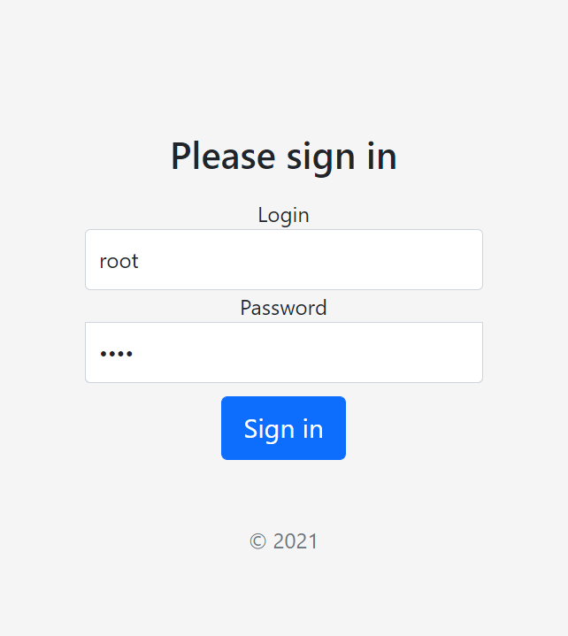
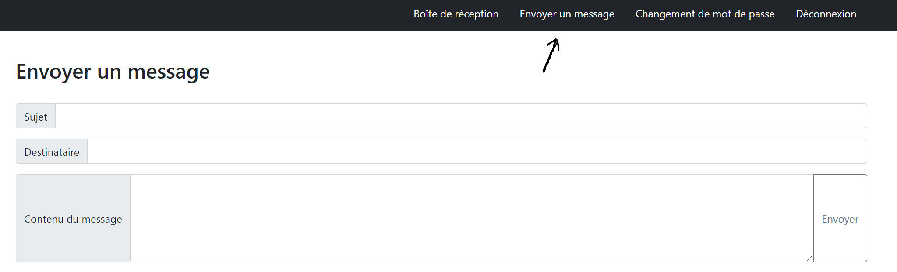
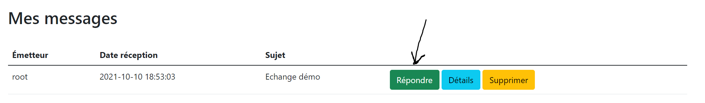
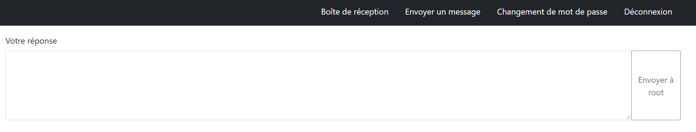
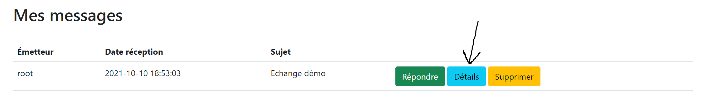
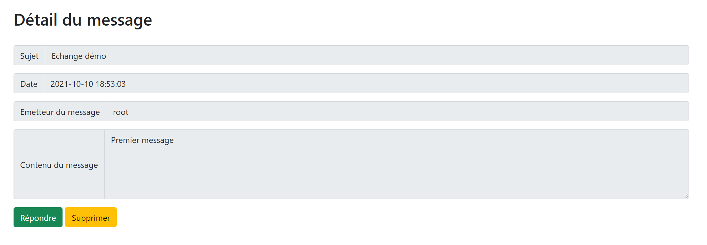
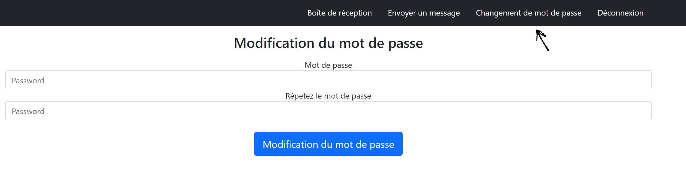
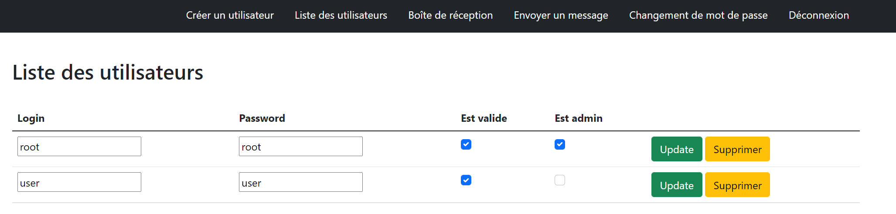
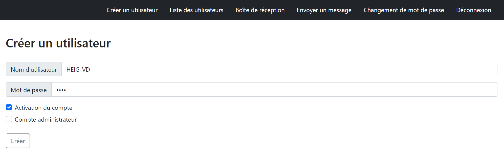

# STI - Projet 1 - Messagerie

Auteurs: Axel Vallon et Lev Pozniakoff

## Manuel d'installation

Pour déployer le site de messagerie, il suffit de d'exécuter le script `./script.sh` situé à la racine de ce repository git tout en aillant Docker allumé. Cette procédure vous permettra si le port 8080 est accessible d'accéder au site via l'adresse http://localhost:8080. Cette installation est fonctionnelle avec Windows mais devrait aussi l'être avec Linux.

## Manuel d'utilisation

Les fonctionnalités ce ce site sont accordées au cahier des charges qui nous a été délivré et présenté lors du cours STI à la HEIG-VD en 2021.

### Page de connexion

Pour vous connecter, il suffit de rentrer vos identifiants demandés. Par défaut, il existe un compte administrateur `root` ayant pour mot de passe `root` et un utilisateur collaborateur `user` ayant pour mot de passe `user`.

### Envoyer un message

Dès que vous être connecté, vous verrez une barre de navigation qui vous permettra de sélectionner `Envoyer un message`. Ceci effectué, vous pouvez rédiger votre message et l'envoyer.

### Répondre à un message

Dans votre liste de message (Ou Boîte de réception), vous pouvez répondre à un message.

Vous aurez alors un nouvelle interface qui vous permettra d'envoyer un message au même destinataire avec le même sujet.

### Détails d'un message

Dans votre liste de message, vous pouvez visualiser le corps d'un message qui n'est pas pas visible sur la liste des message

### Changement de mot de passe

Vous avez la possibilité de modifier votre mot de passe en insérant deux fois le même nouveau mot passe en accédant à l'onglet `Changement de mot de passe` dans la barre de navigation.

### Administrateur

Il y a deux types de compte : "Collaborateur" et "Modérateur". En vous connectant en temps que modérateur, vous aurez les même droits qu'un collaborateur en plus la gestion des utilisateurs (modification, création, suppression). La barre de navigation contient donc plus de fonctionnalités que pour un collaborateur normal.

#### modifier les utilisateurs

Pour modifier un utilisateur, il faut vous rendre dans liste des utilisateurs dans la barre de navigation

Ensuite, sélectionnez le champs de l'utilisateur que vous souhaitez modifier (sauf le Login qui n'est pas modifiable) et cliquez sur le bouton `Update` qui permettra d'effectuer ces modifications. Vous avez aussi la possibilité de supprimer un utilisateur dans cette liste.

#### Admin : Créer un utilisateur

Vous pouvez en tant que Administrateur créer n'importe quel type de compte, au temps un administrateur qu'un compte inactif (un utilisateur ne pourra pas se connecter sur un compte inactif)

